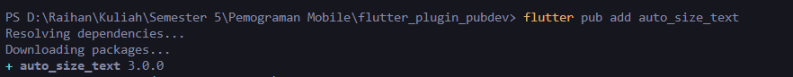

# flutter_plugin_pubdev

A new Flutter project.

## Getting Started

This project is a starting point for a Flutter application.

A few resources to get you started if this is your first Flutter project:

- [Lab: Write your first Flutter app](https://docs.flutter.dev/get-started/codelab)
- [Cookbook: Useful Flutter samples](https://docs.flutter.dev/cookbook)

For help getting started with Flutter development, view the
[online documentation](https://docs.flutter.dev/), which offers tutorials,
samples, guidance on mobile development, and a full API reference.

# Laporan Tugas

<table>
    <thead>
        <th style="text-align: center;" colspan="2">Pertemuan 2</th>
    </thead>
    <tbody>
        <tr>
            <td>Nama</td>
            <td>Raihan Fazzaufa Rasendriya</td>
        </tr>
        <tr>
            <td>NIM</td>
            <td>2241720201</td>
        </tr>
        <tr>
            <td>Kelas</td>
            <td>TI-3G</td>
        </tr>
        <tr>
            <td>Absen</td>
            <td>22</td>
        </tr>
    </tbody>
</table>

## Tugas
### Soal 1
Selesaikan Praktikum tersebut, lalu dokumentasikan dan push ke repository Anda berupa screenshot hasil pekerjaan beserta penjelasannya di file `README.md`!

1. Membuat project Flutter baru dengan nama `flutter_plugin_pubdev` dan dijadikan repository di GitHub dengan nama yang sama.

2. Menambahkan plugin `auto_size_text` menggunakan terminal.

3. Membuat file `red_text_widget.dart` diisi dengan widget yang nantinya akan ditambahkan plugin `auto_size_text`

4. Mengubah kode `return Container()` menjadi kode seperti yang ada pada praktikum.

untuk langkah ini akan terjadi error karena variabel `text` belum terdefinisi.

5. Menambahkan variabel `text` dan parameter pada constructor.

6. Menambahkan kode seperti yang ada pada praktikum di dalam `children: ` pada `_MyHomePageState`.

### Soal 2
Jelaskan maksud dari langkah 2 pada praktikum tersebut!

langkah 2 digunakan untuk menambahkan suatu plugin ke dalam project flutter yang telah dibuat dengan menggunakan syntax `flutter pub add [nama_plugin]` pada terminal.

### Soal 3
Jelaskan maksud dari langkah 5 pada praktikum tersebut!

Langkah 5 digunakan untuk menambahkan variabel `text` serta parameter `text` pada constructor agar apabila widget dipanggil maka value dari `text` akan menyesuaikan isi dari parameternya.

### Soal 4
Pada langkah 6 terdapat dua widget yang ditambahkan, jelaskan fungsi dan perbedaannya!

widget pertama menggunakan plugin `auto_size_text` yang berfungsi untuk menyesuaikan ukuran text dengan ukuran dari parentnya. Sedangkan widget kedua tidak menggunakan plugin tersebut sehingga ukuran text akan tetap seperti itu.

### Soal 5
Jelaskan maksud dari tiap parameter yang ada di dalam plugin auto_size_text berdasarkan tautan pada dokumentasi [ini](https://pub.dev/documentation/auto_size_text/latest/)!

1. key: Mengontrol bagaimana satu widget menggantikan widget lain dalam pohon widget.
2. textKey: Menentukan kunci untuk widget teks yang dihasilkan.
3. style: Jika tidak null, ini adalah gaya yang digunakan untuk teks (seperti warna, ukuran font, dan lain-lain).
4. minFontSize: Ukuran font minimum yang diizinkan ketika teks di-resize. Secara default, nilai minimum adalah 12.
5. maxFontSize: Ukuran font maksimum yang diizinkan untuk teks. Nilai ini diabaikan jika presetFontSizes digunakan.
6. stepGranularity: Ukuran langkah pengurangan ketika teks diubah ukurannya. Semakin kecil nilai ini, semakin halus perubahan ukuran teks.
7. presetFontSizes: Daftar ukuran font yang sudah ditentukan sebelumnya. Jika diatur, minFontSize, maxFontSize, dan stepGranularity diabaikan.
8. group: Digunakan untuk menyinkronkan ukuran font di beberapa widget AutoSizeText, sehingga mereka memiliki ukuran font yang sama dalam satu grup.
9. textAlign: Mengatur bagaimana teks disejajarkan secara horizontal (misalnya, kiri, tengah, atau kanan).
10. textDirection: Mengatur arah teks (kiri-ke-kanan atau kanan-ke-kiri).
11. locale: Menentukan locale untuk memilih font yang sesuai.
12. softWrap: Mengatur apakah teks harus memecah baris pada garis lunak (soft line breaks).
13. wrapWords: Menentukan apakah kata-kata yang tidak muat dalam satu baris harus dibungkus. Secara default, nilainya adalah true.
14. overflow: Mengontrol bagaimana menangani overflow visual ketika teks tidak muat dalam area yang ditentukan.
15. overflowReplacement: Widget pengganti yang akan ditampilkan jika teks meluap dan tidak bisa disesuaikan dengan area yang tersedia.
16. textScaleFactor: Mengontrol jumlah piksel font untuk setiap piksel logis.
17. maxLines: Jumlah maksimum baris teks yang diizinkan sebelum teks terpotong.
18. semanticsLabel: Label semantik alternatif yang bisa digunakan untuk teks ini.

### Soal 6
Kumpulkan laporan praktikum Anda berupa link repository GitHub kepada dosen!